# Soroban SAS Architecture

## Overview
The Soroban Attestation Service (SAS) is composed of three primary components:
1. **Schema Registry**: Stores reusable data layouts (schemas) identified by deterministic UIDs.
2. **SAS Core Contract**: Issues, revokes and verifies attestations based on registered schemas.
3. **Indexer Contract**: Provides efficient off-chain and on-chain reverse lookups for recipients, schemas and attesters.
4. **Cross-chain Verifier**: Tracks short-lived remote attestation verdicts delivered through an Axelar GMP gateway. It is deployed separately from the SAS v1 contract and binds one remote source contract and chain at initialization.

## Design Goals
- High throughput via parallelized state access.
- Minimal gas overhead.
- Strict payload boundaries to prevent gas exhaustion attacks.

---

## System Overview

The following diagram shows the high-level static relationships between all contracts and external actors.

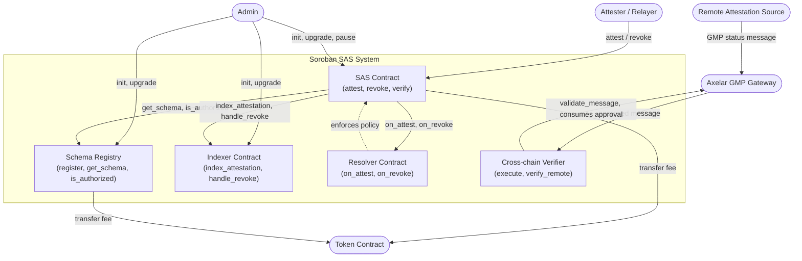

Remote verification has a different trust boundary from `SAS::verify_attestation`: the local SAS reads its own attestation state, while the cross-chain verifier accepts only a status message approved by its configured Axelar gateway and sent by its configured remote source. The source must compute the verdict from its authoritative registry. Positive verdicts expire within 24 hours, and later messages must increase the per-UID revision. See [Cross-chain verification](cross-chain-verification.md) for the wire format, deployment and stale-state limits.

---

## Initialization and Compatibility Probes

Before trusting a dependency address, each contract issues a **compatibility probe** — a cross-contract call to a well-known marker function. If the call fails or returns false, initialization is rejected with `IncompatibleDependency`.

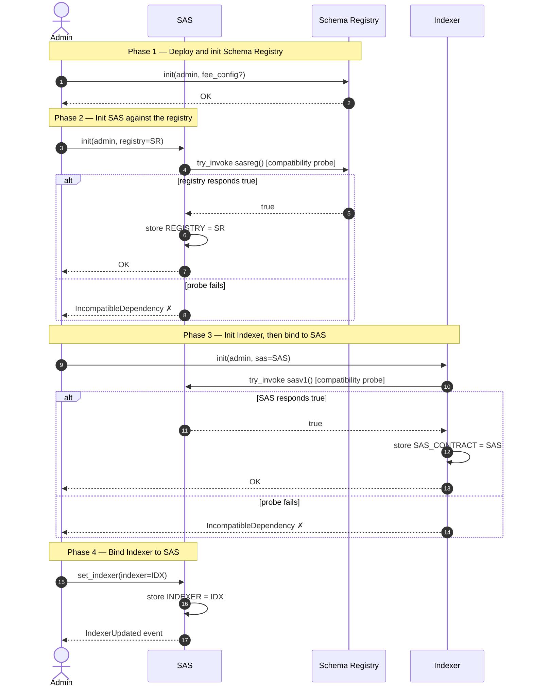

---

## Attestation Issuance Flow

This is the most complex cross-contract flow. Every `attest`, `attest_by_delegation`, `multi_attest`, and `attest_with_value` call converges on `attest_internal`.

### Direct Issuance (`attest`)

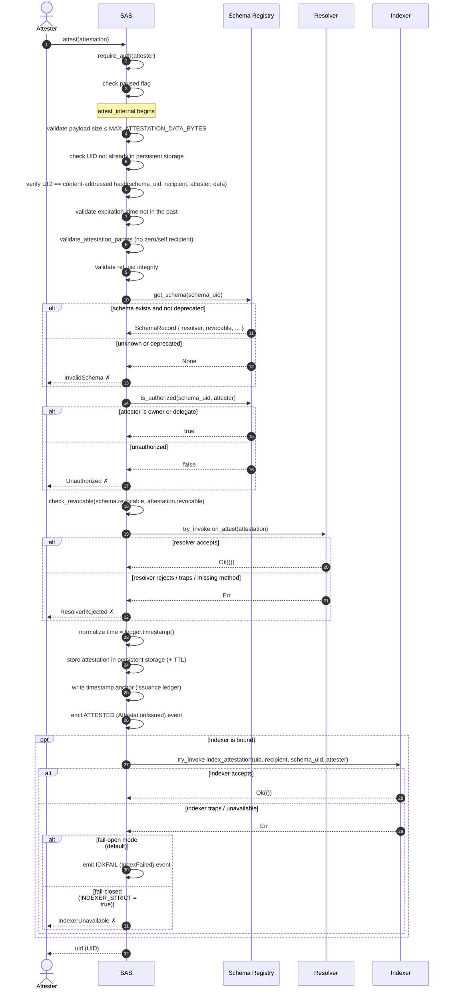

### Delegated Issuance (`attest_by_delegation`)

Delegated issuance substitutes the attester's `require_auth()` with an **off-chain ed25519 signature** verification. The on-chain storage path is identical to direct issuance.

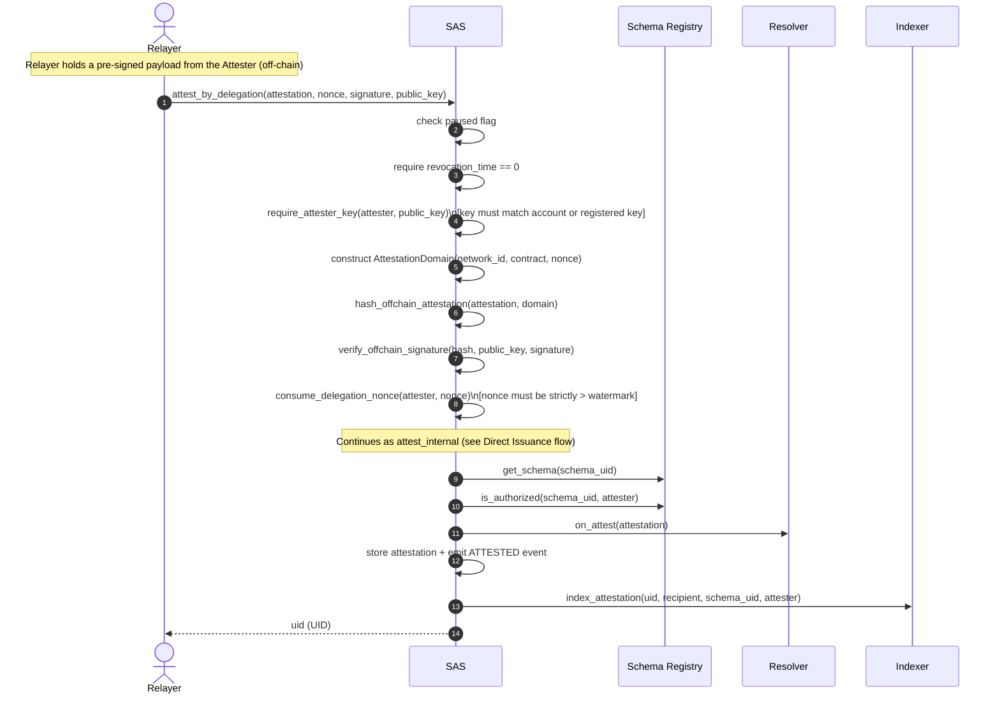

### Batch Issuance (`multi_attest`)

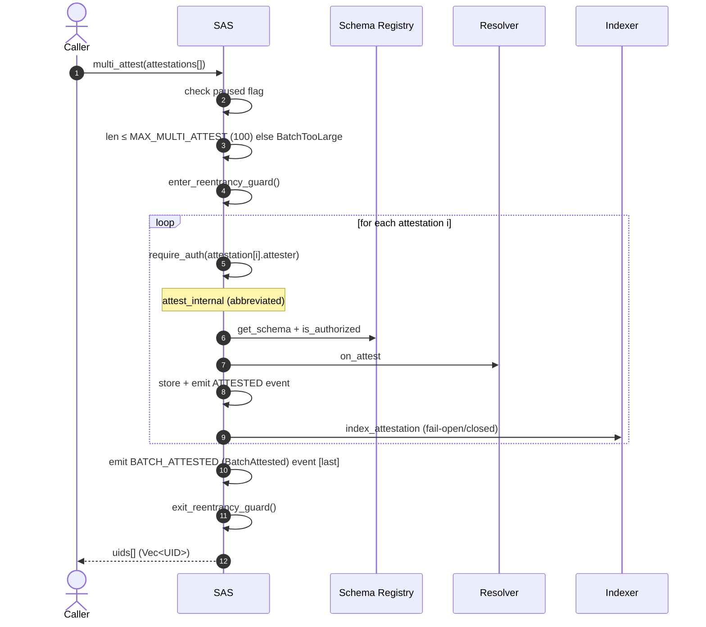

---

## Attestation Revocation Flow

### Direct Revocation (`revoke`)

```mermaid
sequenceDiagram
    autonumber
    actor Attester
    participant SAS
    participant SR as Schema Registry
    participant Resolver
    participant IDX as Indexer

    Attester->>SAS: revoke(uid)
    SAS->>SAS: check paused flag
    SAS->>SAS: require_auth(attester from stored attestation)

    Note over SAS: revoke_internal begins
    SAS->>SAS: load attestation from persistent storage
    SAS->>SAS: assert revocable == true
    SAS->>SAS: assert revocation_time == 0
    SAS->>SAS: set revocation_time = ledger.timestamp()
    SAS->>SAS: persist updated attestation (+ TTL)
    SAS->>SAS: write revocation timestamp anchor
    SAS->>SAS: emit REVOKED (AttestationRevoked) event

    SAS->>SR: get_schema(attestation.schema_uid)
    alt schema exists
        SR-->>SAS: SchemaRecord { resolver, ... }
    else schema missing
        SR-->>SAS: None
        SAS-->>Attester: InvalidSchema ✗ [rolls back]
    end

    SAS->>Resolver: try_invoke on_revoke(attestation)
    alt resolver accepts
        Resolver-->>SAS: Ok(())
    else resolver rejects / traps / missing
        Resolver-->>SAS: Err
        SAS-->>Attester: ResolverRejected ✗ [rolls back storage + event]
    end

    opt Indexer is bound
        SAS->>IDX: try_invoke handle_revoke(uid) [best-effort; silently ignored if absent]
        Note over IDX: When implemented, updates IndexStatus → Revoked\n(not present in current indexer; failure is silently ignored)
    end

    SAS-->>Attester: () [success]
```

> **Note on resolver ordering during revocation:** The revocation write and its `REVOKED` event are committed to the call frame before `on_revoke` is invoked. If the resolver rejects, the entire invocation rolls back — including the write and the event — so observers never see a half-committed revocation.

> **Note on `handle_revoke`:** The SAS contract calls `handle_revoke` on the Indexer as a best-effort `try_invoke_contract`. If the Indexer does not implement the method (the current version does not), or if the call fails for any reason, SAS silently ignores the error. This allows the indexer to be upgraded independently to add status-tracking callbacks without requiring a simultaneous SAS upgrade.

### Delegated Revocation (`revoke_by_delegation`)

```mermaid
sequenceDiagram
    autonumber
    actor Relayer
    participant SAS
    participant SR as Schema Registry
    participant Resolver
    participant IDX as Indexer

    Relayer->>SAS: revoke_by_delegation(uid, nonce, signature, public_key)
    SAS->>SAS: check paused flag
    SAS->>SAS: load attestation by uid
    SAS->>SAS: require_attester_key(attestation.attester, public_key)
    SAS->>SAS: construct AttestationDomain(network_id, contract, nonce)
    SAS->>SAS: hash_delegated_revocation(uid, attester, domain)
    SAS->>SAS: verify_offchain_signature(hash, public_key, signature)
    SAS->>SAS: consume_delegation_nonce(attester, nonce)

    Note over SAS: Continues as revoke_internal (see Direct Revocation flow)
    SAS->>SAS: set revocation_time + persist
    SAS->>SAS: emit REVOKED event
    SAS->>SR: get_schema → on_revoke via Resolver
    SAS->>IDX: try_invoke handle_revoke(uid) [best-effort; silently ignored if absent]

    SAS-->>Relayer: () [success]
```

### Batch Revocation (`multi_revoke`)

```mermaid
sequenceDiagram
    autonumber
    actor Caller
    participant SAS
    participant SR as Schema Registry
    participant Resolver
    participant IDX as Indexer

    Caller->>SAS: multi_revoke(revocations[])
    SAS->>SAS: check paused flag
    SAS->>SAS: len ≤ MAX_MULTI_REVOKE (100) else BatchTooLarge

    Note over SAS: Pass 1 — Validate all items before any write
    loop for each uid i
        SAS->>SAS: load attestation[i], assert revocable + not revoked
        SAS->>SAS: group by attester for auth
    end
    SAS->>SAS: require_auth for each distinct attester

    Note over SAS: Pass 2 — Commit revocations
    loop for each uid i
        Note over SAS: revoke_internal (abbreviated)
        SAS->>SAS: set revocation_time + persist + emit REVOKED event
        SAS->>SR: get_schema + on_revoke via Resolver
        SAS->>IDX: try_invoke handle_revoke(uid) [best-effort; silently ignored if absent]
    end

    SAS->>SAS: emit BATCH_REVOKED (BatchRevoked) event [last]
    SAS-->>Caller: () [success]
```

---

## Attestation Replacement Flow (`replace_attestation`)

`replace_attestation` atomically revokes an old attestation and issues a new one linked via `ref_uid`, eliminating any validity gap between the two.

```mermaid
sequenceDiagram
    autonumber
    actor Attester
    participant SAS
    participant SR as Schema Registry
    participant Resolver
    participant IDX as Indexer

    Attester->>SAS: replace_attestation(old_uid, new_data)
    SAS->>SAS: check paused flag
    SAS->>SAS: load old attestation, assert revocable + not revoked
    SAS->>SAS: assert new_data.attester == old.attester
    SAS->>SAS: assert new_data.recipient == old.recipient
    SAS->>SAS: assert new expiration_time ≥ old (monotonicity rule)
    SAS->>SAS: require_auth(old.attester)
    SAS->>SAS: set new_data.ref_uid = old_uid [enforced, not caller-supplied]

    Note over SAS: revoke_internal on old_uid
    SAS->>SAS: set old.revocation_time, persist, emit REVOKED event
    SAS->>SR: get_schema(old.schema_uid) → on_revoke(old attestation)
    SAS->>IDX: try_invoke handle_revoke(old_uid) [best-effort; silently ignored if absent]

    Note over SAS: attest_internal on new_data
    SAS->>SR: get_schema(new_data.schema_uid) + is_authorized(schema_uid, attester)
    SAS->>Resolver: on_attest(new_data)
    SAS->>SAS: store new attestation, emit ATTESTED event
    SAS->>IDX: index_attestation(new_uid, ...) [fail-open/closed]

    SAS-->>Attester: new_uid (UID)
```

---

## Indexer Reconciliation Flow

When the Indexer is unavailable during issuance, SAS emits an `IDXFAIL` event (fail-open mode) instead of rolling back. Operators can replay missed attestations using `reindex_attestation` or `bulk_reindex`.

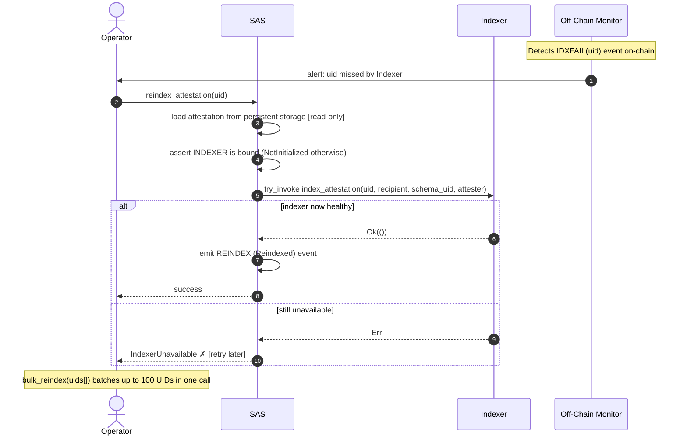

---

## Schema Registry Flows

### Schema Registration (`register`)

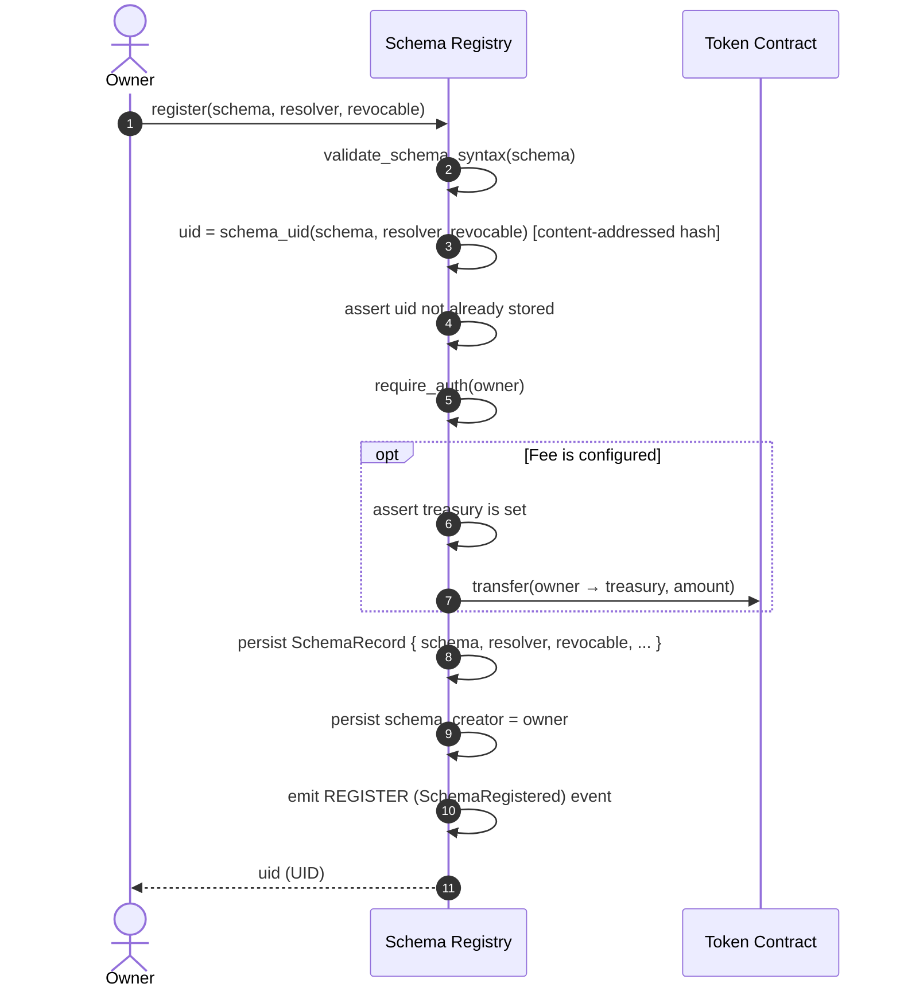

### Schema Deprecation (`deprecate`)

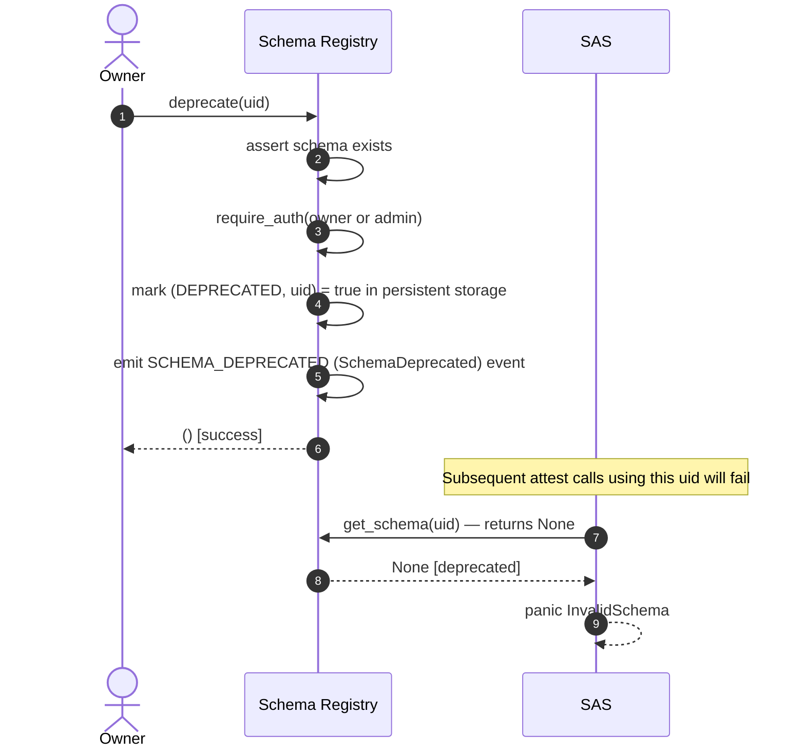

---

## Indexer Write Authorization

`index_attestation` is **not a public write path**. It uses Soroban's native contract-address `require_auth()` mechanism so that only the exact SAS contract bound at `Indexer::init` can invoke it successfully.

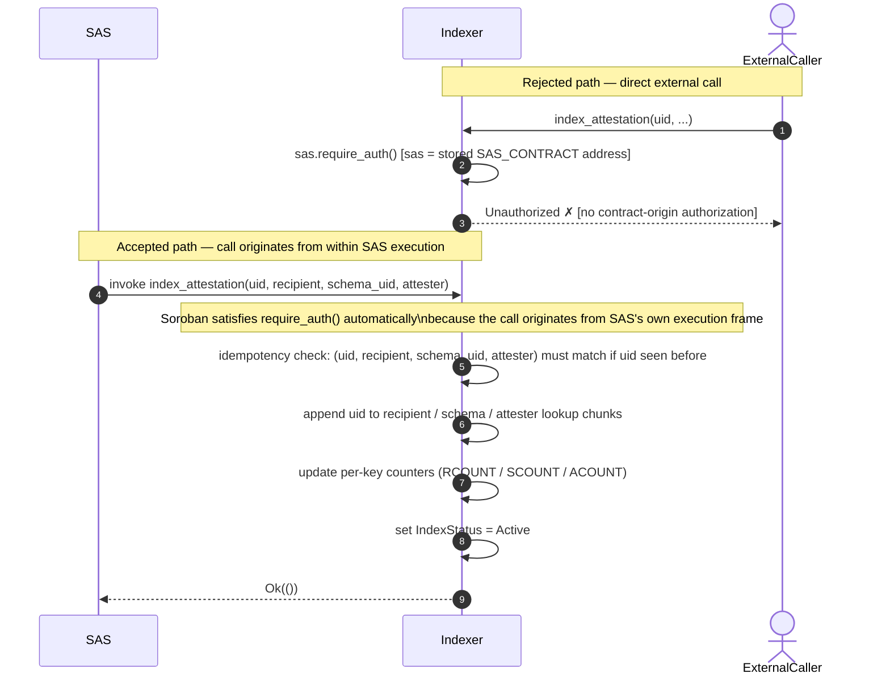

---

## Upgrade Flow

All three contracts share the same monotonic versioned upgrade pattern. Each upgrade is admin-authorized, validated against the stored layout before any state is written, and emits a `ContractUpgraded` event immediately before the WASM swap.

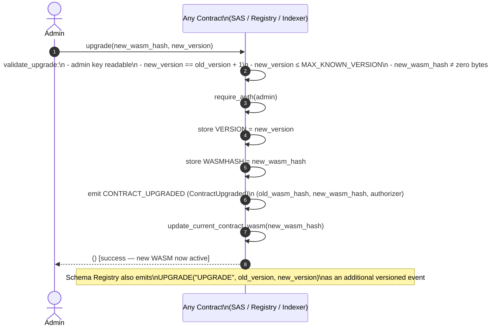

---

## Storage Retention Policy

Soroban has two independent expiry mechanisms, and each contract's core
configuration is deliberately held to a stricter policy than the
attestation/schema data it governs:

- **Instance storage** holds a contract's core configuration: SAS's
  `SAS_ADMIN`, `SCHEMA_REGISTRY`, and `INDEXER` bindings; the schema
  registry's `REGISTRY_ADMIN`, `SCHEMA_FEE`, and `TREASURY`; and the
  indexer's `INDEXER_ADMIN` and `SAS_CONTRACT` binding. If instance storage
  expires and is archived, the contract's own configuration becomes
  unreadable and every entry point that depends on it stops working —
  there is no way to "read the admin address to renew the admin address."
  For this reason every contract renews its instance TTL
  (`soroban_sas_common::extend_instance_ttl`, using the shared
  `INSTANCE_TTL_THRESHOLD_LEDGERS`/`INSTANCE_EXTEND_TO_LEDGERS` constants)
  from `init` and from both admin-gated and commonly used public entry
  points, so ordinary traffic keeps configuration alive without any single
  call being solely responsible for it.
- **Persistent storage** holds the data instance configuration governs —
  attestations, schema records, delegation nonces, indexer lookup chunks —
  and is extended independently, per entry, using `LEDGERS_IN_ONE_YEAR`
  wherever it is written or read. An individual attestation or schema
  expiring does not take down the rest of the contract the way a lost
  admin binding would, so persistent entries are extended on their own
  schedule rather than the stricter instance policy. The indexer's per-key
  UID counters (`RCOUNT`/`SCOUNT`/`ACOUNT`) live here too, on the same
  horizon as the chunks they count — they used to live in instance storage,
  where their independent expiry from the chunk data they count could reset
  a counter to zero while its chunks survived, corrupting the index with
  duplicate UIDs on the next write (#219).
  Timestamp anchors (#298) — the ledger sequence and close time recorded
  for each issuance and revocation — are written on the same per-entry
  schedule, with the TTL of the attestation they describe, so a record's
  verifiable timestamps never outlive the record itself.

---

## Contract Upgrades

All three contracts are upgraded in place by an admin-authorized
`upgrade(new_wasm_hash, new_version)`. Each contract stores a monotonic
instance `VERSION` (a missing key on a legacy instance reads as genesis `1`),
accepts only the exact next audited version, and requires the candidate to be
non-zero and already uploaded. Validation reads the existing layout before any
state is written; the version and the targeted hash (`WASMHASH`) are then
committed, and each contract emits `ContractUpgraded` with
`(old_wasm_hash, new_wasm_hash, authorizer)` immediately before the swap is
requested. The schema registry additionally emits its own versioned
`UPGRADE("UPGRADE", old_version, new_version)` event. Because Soroban rolls a
failed invocation back, an upgrade event an off-chain consumer observes always
corresponds to an activation that durably took effect.

See [Contract Events](events.md) for the payloads and the
[Contract Upgrade and Recovery Runbook](UPGRADE_RUNBOOK.md) for the staged
activation and rollback procedure.

---

## Trust Boundaries

### Indexer writes

`Indexer::index_attestation` is not a public write path. It records UIDs
into the recipient, schema, and attester lookup tables, and those tables are
only useful if every entry actually corresponds to an attestation the SAS
contract issued. If any caller could invoke it directly, an attacker could
inject arbitrary UIDs and silently poison every reverse lookup the indexer
serves.

`index_attestation` therefore requires `sas.require_auth()`, where `sas` is
the address recorded by `Indexer::init`. Soroban satisfies a contract
address's `require_auth()` without an explicit signature when the call
originates from that contract's own execution — concretely, only
`SAS::attest_internal` invoking `index_attestation` as part of handling
`attest`/`attest_by_delegation`/`multi_attest`/`attest_with_value` can
satisfy it. An external account, or any other contract (including one that
merely forwards the same arguments), cannot produce this authorization and
the call is rejected. A call made before `Indexer::init` has bound a SAS
address is rejected outright, since there is no trusted address to
authorize against yet.

This mirrors how `SAS::init` and `Indexer::init` already gate on a
compatibility probe (`sasreg`/`sasv1`) before trusting a configured
dependency address — the indexer's SAS binding is a similar one-way trust
relationship, just enforced per-call instead of once at initialization.

### Indexer Pagination

Each lookup key's history is stored as fixed-size persistent chunks of
`MAX_CHUNK_SIZE` (100) UIDs plus a per-key counter. The complete reads
(`get_attestations_by_*`) walk every chunk and so grow with the history.
Callers with large histories use the paginated reads instead:
`get_atts_by_recipient_paginated`, `get_atts_by_schema_paginated`, and
`get_atts_by_attester_paginated`, each `(key, cursor, limit)`. All three share
one reader (`collect_page`), which loads only the chunks that overlap the
requested window. A page therefore costs `O(limit)` storage reads and TTL
renewals, not `O(count)`.

Pagination semantics follow from the append-only index. Ordering is
insertion order (oldest first), and new UIDs are only ever appended, so pages
stay stable while issuance continues. A page holds exactly
`min(limit, count - cursor)` UIDs, so resuming at `cursor + page.len()` never
skips or repeats an entry. `limit == 0` and any request at or beyond the end
return an empty page. `get_count_by_*` provides `count` for totals. Paginated
reads count toward the per-ledger query limit (`LimitExceeded`). The SDK
(`IndexerClient::get_attestations_by_*_paginated`) and the CLI
(`query by-* --cursor/--limit`, 1–100 UIDs per page) expose the same model.

### Recipients

Every on-chain attestation has a concrete recipient. SAS rejects the zero
account/contract sentinels that other attestation systems use for "no
recipient", and it rejects an attester naming itself, with `InvalidRecipient`
(`soroban_sas_common::validate_attestation_parties`). The Indexer therefore
never receives a recipient-less record. The SDK's `AttestationRequestBuilder`
and the CLI's on-chain issuance commands apply the same shared check before
building a transaction.

### Indexing progress

A first-time `index_attestation` publishes `IndexingProgress` (`IDXPROG`)
with the recipient as a topic and the updated recipient, schema, and attester
counts in the payload. Retries of an identical triple stay silent, so
consumers can treat each event as one newly indexed UID. See
[Contract Events](events.md).

### Indexer Reconciliation

When running under default fail-open mode, any downstream indexing failures emit `IndexFailed(uid)` (`IDXFAIL`) events rather than rolling back core attestation writes. Operators recover missed entries using `SAS::reindex_attestation(uid)`.

For operational instructions covering event detection, unreconciled UID enumeration, CLI/SDK invocation, health checks, and retry strategies, see the [Indexer Reconciliation Runbook](reconciliation.md) and [Indexer Availability Policy](indexer-availability-and-fees.md).

### Delegated signature authorization

`attest_by_delegation`, `revoke_by_delegation`, and their batch variants
(`multi_attest_by_delegation`, `multi_revoke_by_delegation`) authorize a write
from an off-chain ed25519 signature instead of `require_auth()` on the
attester. The relayer that submits the transaction consequently needs no
special privilege: it only funds and signs the envelope, and the contract
derives authority from the issuer's signature.

A signature commits to the network id, the SAS contract address, and a
per-attester nonce, then to the action's own fields (the full attestation, or
the UID plus recorded attester for a revocation). That binding is what makes a
signature meaningful for exactly one network, one contract deployment, and one
nonce, and it is what prevents a relayer from substituting a different payload.
The nonce high-watermark is per attester and shared by issuance and revocation;
see [Delegated Issuance and Revocation](delegation.md) for the full model,
limitations, and the SDK signing helpers.

---

## Attestation Lifecycle and State Machine

An attestation within the Soroban SAS framework flows through several definitive states managed strictly by the core SAS smart contract:

```mermaid
stateDiagram-v2
    [*] --> Active : attest / multi_attest\nattest_by_delegation

    Active --> Revoked : revoke / revoke_by_delegation\nmulti_revoke / replace_attestation (old uid)
    Active --> Expired : ledger.timestamp() > expiration_time\n[no transaction needed]
    Active --> Replaced : replace_attestation\n(new attestation issued with ref_uid → old uid)

    Replaced --> [*] : old uid is revoked;\nnew uid is Active
    Revoked --> [*]
    Expired --> [*]

    note right of Active
        revocation_time == 0
        AND (expiration_time == 0
             OR timestamp < expiration_time)
    end note

    note right of Revoked
        revocation_time != 0
        verify_attestation → false
    end note

    note right of Expired
        expiration_time != 0
        AND timestamp >= expiration_time
        verify_attestation → false
    end note
```

- **Issuance (`attest` / `multi_attest`)**: A new, revocable or non-revocable attestation is firmly anchored to the chain. A deterministic `UID` is assigned based strictly on `(schema_uid, recipient, attester, data, time, expiration_time, revocable)`.
- **Active State**: While `timestamp < expiration_time` (and `expiration_time != 0`) and `revocation_time == 0`, the attestation is publicly active.
- **Revoked State (`revoke`)**: If the attestation was initialized with `revocable = true`, the `attester` (or a delegated proxy) can flip the state by setting the `revocation_time` parameter on-chain. From this moment, `verify_attestation` returns `false`.
- **Expired State**: Occurs naturally when the ledger timestamp overtakes `expiration_time`. No explicit transaction is needed to reach this state. Expired attestations strictly cannot be actively rotated or replaced in-place.
- **Replacement (`replace_attestation`)**: Binds an active, non-revoked attestation into a revoked state natively, synchronously emitting a new child attestation mapped backwards through the `ref_uid` pointer structure.

## CLI operations

`soroban-sas` prints RPC and transport failures as a short operator sentence
(rate limits, unreachable endpoints, and other RPC errors) and keeps the
original diagnostic in parentheses. Signing commands accept
`--hardware-wallet ledger|trezor` with `--hd-account`. A hardware wallet
never falls back to `--secret-key`; the device path is `SAS_LEDGER_DEVICE`
or `SAS_TREZOR_DEVICE`. `soroban-sas man` writes a groff man page for the
current command tree (`--path` selects a file).
## Mutation Testing

The workspace has a mutation testing baseline measured with `cargo-mutants`.
It shows which behaviour the test suites do not actually check, beyond what
line coverage reports. Results, exclusions and reproduction steps are in
[MUTATION_TESTING.md](MUTATION_TESTING.md).

- Configuration: `.cargo/mutants.toml`
- CI: the "Mutation Testing" workflow, manual only (`workflow_dispatch`), so
  the existing CI, coverage and fuzz pipelines are unaffected.
---

## Event Summary

The table below maps every cross-contract flow to the events it emits, in the order they appear on-chain.

| Flow | Contract | Event constant | Struct |
|---|---|---|---|
| `attest` / `attest_by_delegation` | SAS | `ATTESTED` | `AttestationIssued` |
| `multi_attest` (each item) | SAS | `ATTESTED` | `AttestationIssued` |
| `multi_attest` (summary) | SAS | `BATCH_ATTESTED` | `BatchAttested` |
| `revoke` / `revoke_by_delegation` | SAS | `REVOKED` | `AttestationRevoked` |
| `multi_revoke` (each item) | SAS | `REVOKED` | `AttestationRevoked` |
| `multi_revoke` (summary) | SAS | `BATCH_REVOKED` | `BatchRevoked` |
| `replace_attestation` | SAS | `REVOKED` then `ATTESTED` | `AttestationRevoked`, `AttestationIssued` |
| Indexer push failure (fail-open) | SAS | `IDXFAIL` | `uid` |
| `reindex_attestation` / `bulk_reindex` success | SAS | `REINDEX` | `uid` |
| `register` | Schema Registry | `REGISTER` | `SchemaRegistered` |
| `deprecate` | Schema Registry | `SCHEMA_DEPRECATED` | `SchemaDeprecated` |
| `upgrade` | SAS / Registry / Indexer | `CONTRACT_UPGRADED` | `ContractUpgraded` |
| `set_indexer` | SAS | `INDEXER_UPDATED` | `IndexerUpdated` |
| `set_fee` / `clear_fee` | SAS | `FEECFG_UPDATED` | `FeeConfigUpdated` |
| `pause` | SAS | `CONTRACT_PAUSED` | `ContractPaused` |
| `unpause` | SAS | `CONTRACT_UNPAUSED` | `ContractUnpaused` |
| `propose_admin` | SAS | `ADMIN_TRANSFER_PROPOSED` | `AdminTransferProposed` |
| `accept_admin` | SAS | `ADMIN_TRANSFER_COMPLETED` | `AdminTransferCompleted` |

For complete payload schemas and XDR encoding, see [Contract Events](events.md).

---

## Cross-Contract Call Summary

The following table is a concise reference of every cross-contract call in the system.

| Caller | Callee | Method | Direction | Fail behaviour |
|---|---|---|---|---|
| SAS `init` | Schema Registry | `sasreg()` | probe | Rejects init with `IncompatibleDependency` |
| Indexer `init` | SAS | `sasv1()` | probe | Rejects init with `IncompatibleDependency` |
| SAS `attest_internal` | Schema Registry | `get_schema(uid)` | mandatory read | Panics `InvalidSchema` on None |
| SAS `attest_internal` | Schema Registry | `is_authorized(uid, attester)` | mandatory read | Panics `Unauthorized` on false |
| SAS `attest_internal` | Resolver | `on_attest(attestation)` | mandatory callback | Panics `ResolverRejected` on any error |
| SAS `attest_internal` | Indexer | `index_attestation(uid, recipient, schema_uid, attester)` | optional write | `IDXFAIL` event (fail-open) or `IndexerUnavailable` (fail-closed) |
| SAS `revoke_internal` | Schema Registry | `get_schema(uid)` | mandatory read | Panics `InvalidSchema` on None |
| SAS `revoke_internal` | Resolver | `on_revoke(attestation)` | mandatory callback | Panics `ResolverRejected` → rolls back revocation write + event |
| SAS `revoke_internal` | Indexer | `handle_revoke(uid)` | optional write | Silently ignored if method absent or call fails (best-effort) |
| SAS `reindex_attestation` | Indexer | `index_attestation(uid, ...)` | optional write | Returns `IndexerUnavailable` on failure |
| SAS `attest_with_value` | Token Contract | `transfer(attester → SAS, amount)` | mandatory transfer | Panics on failure |
| Schema Registry `register_with_value` | Token Contract | `transfer(owner → treasury, amount)` | mandatory transfer | Panics on failure |
